# Lotto Architecture

This document provides an overview of the Lotto system architecture. The project is designed as a microservices-based application, with each service having a distinct responsibility. This approach enhances modularity, scalability, and maintainability.

## Core Components

The system is composed of several key services that work together:

- **Frontend:** The user-facing application, built with Vite. It provides the user interface for displaying lottery results and other information.
- **OAPI (OpenAPI):** The main backend service. It acts as the central API gateway, managing business logic, data persistence, and communication between other services. It exposes a RESTful API for the frontend.
- **Scrapper:** A dedicated service responsible for fetching (scraping) the latest lottery results from external data sources.
- **Image Maker (imaker):** A service that generates images from the lottery results data. These images are likely formatted for easy sharing on social media.
- **SN Publisher (Social Network Publisher):** This service is responsible for publishing the generated result images and data to various social media platforms.
- **Database:** A PostgreSQL database (inferred from Prisma usage) used by the OAPI service to store all application data, including lottery results, collections, etc.
- **Message Queue:** A messaging system (Redis Pub/Sub) used for asynchronous communication between services. This decouples the services and ensures that processes like image generation and social media publishing do not block the main data ingestion flow.

## Architecture Diagram

The following diagram illustrates the interaction between the different components of the Lotto system.

```mermaid
graph TD
    subgraph "External Systems"
        direction TB
        LotteryDataSource[Lottery Data Source]
        SocialNetworks[Social Networks]
        ObjectStorage[S3]
    end

    User[👤 User]
    subgraph "Lotto System"
        direction TB

        subgraph "Core API & Frontend"
            Frontend[🌐 Frontend]
            OAPI[⚙️ OAPI]
            DB[(🐘 Database)]

            User --> Frontend
            Frontend <--> OAPI
            OAPI <--> DB
        end

        subgraph "Data Processing Pipeline"
            Scrapper[🕷️ Scrapper]
            MQ[(📨 Message Queue)]
            IMaker[🖼️ Image Maker]
            SNPublisher[📢 SN Publisher]

            Scrapper -- 1. Fetches data --> LotteryDataSource
            Scrapper -- 2. Save results --> DB
            Scrapper -- 3. Publishes 'new_result' event --> MQ
            IMaker -- 4. Subscribes to 'new_result' --> MQ
            IMaker -- 5. Generates image & save in object storage --> ObjectStorage
            IMaker -- 6. Publishes 'image_ready' --> MQ
            SNPublisher -- 7. Subscribes to 'image_ready' --> MQ
            SNPublisher -- 8. Posts to social media --> SocialNetworks
        end
    end

    classDef external fill:#e6e6e6,stroke:#333,stroke-width:2px;
    class LotteryDataSource,SocialNetworks external;
```

## Data Flow

1.  **Data Ingestion:** The `Scrapper` service periodically fetches new lottery results from an external `Lottery Data Source`.
2.  **Event Publishing:** Upon finding a new result, the `Scrapper` publishes a `new_result` event to the `Message Queue`.
3.  **Data Persistence:** The `Scrapper` service saves it to the `Database`.
4.  **User Interaction:** A `User` interacts with the `Frontend`, which fetches data from the `OAPI` to display the lottery results.
5.  **Image Generation:** The `Image Maker` service is also subscribed to `new_result` events. It takes the result data, generates a corresponding image, and publishes an `image_ready` event to the `Message Queue`, including the image or its location.
6.  **Social Publishing:** The `SN Publisher` service, subscribed to `image_ready` events, takes the final image and text and posts it to the configured `Social Networks`.

This event-driven architecture allows the system to be resilient and scalable. If one of the processing services (like `Image Maker` or `SN Publisher`) fails, the events remain in the queue to be processed later, without affecting the core functionality of data scraping and display on the main website.
